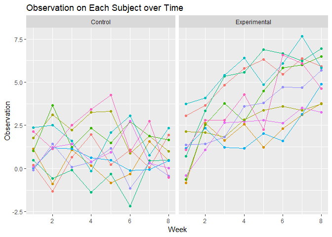

Homework 5
================
Margaret Gacheru

Problem 1
=========

Creating an aggregate dataset for a longitudinal study: data for each participant is included in a separate file and the file names include the participant's ID and treatment arm

``` r
load_file = function (file_name) {
  
  path_base = "./data/"
  complete_path = str_c(path_base, file_name)
  read_csv(complete_path)
}

separate_files = 
  tibble(
    file_name = list.files("./data"))

longitudal_study = separate_files%>%
  mutate(patient_data = map(file_name, load_file))%>%
  unnest()%>%
  gather(key = week, value = observation, week_1:week_8)%>%
  separate(file_name, into = c("arm", "subject_id", "csv"), sep = "[_.]")%>%
  separate(week, into = c("remove", "week"), sep = "_")%>%
  select(-c(csv, remove))
longitudal_study
```

    ## # A tibble: 160 x 4
    ##    arm   subject_id week  observation
    ##    <chr> <chr>      <chr>       <dbl>
    ##  1 con   01         1            0.2 
    ##  2 con   02         1            1.13
    ##  3 con   03         1            1.77
    ##  4 con   04         1            1.04
    ##  5 con   05         1            0.47
    ##  6 con   06         1            2.37
    ##  7 con   07         1            0.03
    ##  8 con   08         1           -0.08
    ##  9 con   09         1            0.08
    ## 10 con   10         1            2.14
    ## # ... with 150 more rows

Making a spaghetti plot that compares each subject's observations over time across the different treatment arms

``` r
longitudal_study%>%
  mutate(arm = recode(arm, "con" = "Control",
                            "exp" = "Experimental"))%>%
  ggplot(aes(as.integer(week), observation, color = subject_id))+
  geom_point()+
  geom_line()+
  facet_grid(.~arm)+
  labs(
    x = "Week",
    y = "Observation",
    title = "Observation on Each Subject over Time")+
  theme(legend.position="none") 
```



In general, there is a notable increase in the observation scores as time progresses in the experimental group. In the control group, the general trend is that the observation scores are relatively similar in week 1 and week 8. While statistical tests are required to determine if the experimental group experienced a significant increase, the graph suggest that the treatment in the experiment group is more effective.

Problem 2
=========

This dataset contains information on homicides in 50 large ctiies across the country.

``` r
url = "https://raw.githubusercontent.com/washingtonpost/data-homicides/master/homicide-data.csv"
homicide_data = read_csv(url)
```

It has 52179 rows and 12 columns. Each row provides information about the victim, location, reported date, and current status of the case. A majority of the variables, including age, are designated as characters but reported date is an integer while longitude and latitude are doubles. For some entries, the victim's race, age, and sex are unknown and values for latitude/longitude are missing. Out of the listed homicides, 25674 are closed by an arrest, 2922 are closed without an arrest, and 23583 are open.

Once a city-state variable is created, the data related to the specific location is stored as a list in a variable.

``` r
homicides_number = function (data){
  length(data$disposition)
}

unsolved_number = function (data){
  data%>%
    filter(disposition %in% c("Closed without arrest", "Open/No arrest"))%>%
    nrow()
}

tidy_homicide_data = 
  homicide_data%>%
  mutate(city_state = str_c(city, ", ", state))%>%
  select(city_state, everything())%>%
  nest(uid:disposition)%>%
  mutate(total_homicides = map(data, homicides_number),
         unsolved_homicides = map(data, unsolved_number))%>%
  mutate(total_homicides = as.integer(total_homicides),
         unsolved_homicides = as.integer(unsolved_homicides))

tidy_homicide_data
```

    ## # A tibble: 51 x 4
    ##    city_state      data                  total_homicides unsolved_homicides
    ##    <chr>           <list>                          <int>              <int>
    ##  1 Albuquerque, NM <tibble [378 x 12]>               378                146
    ##  2 Atlanta, GA     <tibble [973 x 12]>               973                373
    ##  3 Baltimore, MD   <tibble [2,827 x 12]>            2827               1825
    ##  4 Baton Rouge, LA <tibble [424 x 12]>               424                196
    ##  5 Birmingham, AL  <tibble [800 x 12]>               800                347
    ##  6 Boston, MA      <tibble [614 x 12]>               614                310
    ##  7 Buffalo, NY     <tibble [521 x 12]>               521                319
    ##  8 Charlotte, NC   <tibble [687 x 12]>               687                206
    ##  9 Chicago, IL     <tibble [5,535 x 12]>            5535               4073
    ## 10 Cincinnati, OH  <tibble [694 x 12]>               694                309
    ## # ... with 41 more rows

There are 51 distinct city-states in the dataset. Note, one of the city-states is Tulsa, AL -- this is not an actual city (verified by the stated latitude and longitude coordinates). Since there is only one homicide "reported" in Tulsa, AL, this might simply be a recording error of the state.

``` r
tidy_homicide_data%>%
  select(-data)%>%
  knitr::kable(col.names = c("City, State", "Total Homicides", "Unsolved Homicides"))
```

| City, State        |  Total Homicides|  Unsolved Homicides|
|:-------------------|----------------:|-------------------:|
| Albuquerque, NM    |              378|                 146|
| Atlanta, GA        |              973|                 373|
| Baltimore, MD      |             2827|                1825|
| Baton Rouge, LA    |              424|                 196|
| Birmingham, AL     |              800|                 347|
| Boston, MA         |              614|                 310|
| Buffalo, NY        |              521|                 319|
| Charlotte, NC      |              687|                 206|
| Chicago, IL        |             5535|                4073|
| Cincinnati, OH     |              694|                 309|
| Columbus, OH       |             1084|                 575|
| Dallas, TX         |             1567|                 754|
| Denver, CO         |              312|                 169|
| Detroit, MI        |             2519|                1482|
| Durham, NC         |              276|                 101|
| Fort Worth, TX     |              549|                 255|
| Fresno, CA         |              487|                 169|
| Houston, TX        |             2942|                1493|
| Indianapolis, IN   |             1322|                 594|
| Jacksonville, FL   |             1168|                 597|
| Kansas City, MO    |             1190|                 486|
| Las Vegas, NV      |             1381|                 572|
| Long Beach, CA     |              378|                 156|
| Los Angeles, CA    |             2257|                1106|
| Louisville, KY     |              576|                 261|
| Memphis, TN        |             1514|                 483|
| Miami, FL          |              744|                 450|
| Milwaukee, wI      |             1115|                 403|
| Minneapolis, MN    |              366|                 187|
| Nashville, TN      |              767|                 278|
| New Orleans, LA    |             1434|                 930|
| New York, NY       |              627|                 243|
| Oakland, CA        |              947|                 508|
| Oklahoma City, OK  |              672|                 326|
| Omaha, NE          |              409|                 169|
| Philadelphia, PA   |             3037|                1360|
| Phoenix, AZ        |              914|                 504|
| Pittsburgh, PA     |              631|                 337|
| Richmond, VA       |              429|                 113|
| San Antonio, TX    |              833|                 357|
| Sacramento, CA     |              376|                 139|
| Savannah, GA       |              246|                 115|
| San Bernardino, CA |              275|                 170|
| San Diego, CA      |              461|                 175|
| San Francisco, CA  |              663|                 336|
| St. Louis, MO      |             1677|                 905|
| Stockton, CA       |              444|                 266|
| Tampa, FL          |              208|                  95|
| Tulsa, OK          |              583|                 193|
| Tulsa, AL          |                1|                   0|
| Washington, DC     |             1345|                 589|

Estimating proportions and confidence intervals of unsolved homicides in Baltimore, MD

``` r
tidy_homicide_data%>%
  filter(city_state == "Baltimore, MD")%>%
  select(-data)%>%
  mutate(proportion_test = map2(.x = unsolved_homicides, .y = total_homicides, ~prop.test(x = .x, n = .y)),
         proportion_test = map(proportion_test, broom::tidy))%>%
  unnest()%>%
  select(city_state, estimate, conf.low, conf.high)%>%
  knitr::kable(digits = 3,
               col.names = c("City, State", "Proportion of Unsolved Homicides", "Lower CI", "Upper CI"))
```

| City, State   |  Proportion of Unsolved Homicides|  Lower CI|  Upper CI|
|:--------------|---------------------------------:|---------:|---------:|
| Baltimore, MD |                             0.646|     0.628|     0.663|

Estimating proportions and confidence intervals of unsolved homicides in each city

``` r
proportions = tidy_homicide_data%>%
  select(city_state, unsolved_homicides, total_homicides)%>%
  filter(city_state != "Tulsa, AL")%>%
  mutate(proportion_test = map2(.x = unsolved_homicides, .y = total_homicides, ~prop.test(x = .x, n = .y)),
         proportion_test = map(proportion_test, broom::tidy))%>%
  unnest()%>%
  select(city_state, estimate, conf.low, conf.high)

proportions%>%
  knitr::kable(digits = 3,
               col.names = c("City, State", "Proportion of Unsolved Homicides", "Lower CI", "Upper CI"))
```

| City, State        |  Proportion of Unsolved Homicides|  Lower CI|  Upper CI|
|:-------------------|---------------------------------:|---------:|---------:|
| Albuquerque, NM    |                             0.386|     0.337|     0.438|
| Atlanta, GA        |                             0.383|     0.353|     0.415|
| Baltimore, MD      |                             0.646|     0.628|     0.663|
| Baton Rouge, LA    |                             0.462|     0.414|     0.511|
| Birmingham, AL     |                             0.434|     0.399|     0.469|
| Boston, MA         |                             0.505|     0.465|     0.545|
| Buffalo, NY        |                             0.612|     0.569|     0.654|
| Charlotte, NC      |                             0.300|     0.266|     0.336|
| Chicago, IL        |                             0.736|     0.724|     0.747|
| Cincinnati, OH     |                             0.445|     0.408|     0.483|
| Columbus, OH       |                             0.530|     0.500|     0.560|
| Dallas, TX         |                             0.481|     0.456|     0.506|
| Denver, CO         |                             0.542|     0.485|     0.598|
| Detroit, MI        |                             0.588|     0.569|     0.608|
| Durham, NC         |                             0.366|     0.310|     0.426|
| Fort Worth, TX     |                             0.464|     0.422|     0.507|
| Fresno, CA         |                             0.347|     0.305|     0.391|
| Houston, TX        |                             0.507|     0.489|     0.526|
| Indianapolis, IN   |                             0.449|     0.422|     0.477|
| Jacksonville, FL   |                             0.511|     0.482|     0.540|
| Kansas City, MO    |                             0.408|     0.380|     0.437|
| Las Vegas, NV      |                             0.414|     0.388|     0.441|
| Long Beach, CA     |                             0.413|     0.363|     0.464|
| Los Angeles, CA    |                             0.490|     0.469|     0.511|
| Louisville, KY     |                             0.453|     0.412|     0.495|
| Memphis, TN        |                             0.319|     0.296|     0.343|
| Miami, FL          |                             0.605|     0.569|     0.640|
| Milwaukee, wI      |                             0.361|     0.333|     0.391|
| Minneapolis, MN    |                             0.511|     0.459|     0.563|
| Nashville, TN      |                             0.362|     0.329|     0.398|
| New Orleans, LA    |                             0.649|     0.623|     0.673|
| New York, NY       |                             0.388|     0.349|     0.427|
| Oakland, CA        |                             0.536|     0.504|     0.569|
| Oklahoma City, OK  |                             0.485|     0.447|     0.524|
| Omaha, NE          |                             0.413|     0.365|     0.463|
| Philadelphia, PA   |                             0.448|     0.430|     0.466|
| Phoenix, AZ        |                             0.551|     0.518|     0.584|
| Pittsburgh, PA     |                             0.534|     0.494|     0.573|
| Richmond, VA       |                             0.263|     0.223|     0.308|
| San Antonio, TX    |                             0.429|     0.395|     0.463|
| Sacramento, CA     |                             0.370|     0.321|     0.421|
| Savannah, GA       |                             0.467|     0.404|     0.532|
| San Bernardino, CA |                             0.618|     0.558|     0.675|
| San Diego, CA      |                             0.380|     0.335|     0.426|
| San Francisco, CA  |                             0.507|     0.468|     0.545|
| St. Louis, MO      |                             0.540|     0.515|     0.564|
| Stockton, CA       |                             0.599|     0.552|     0.645|
| Tampa, FL          |                             0.457|     0.388|     0.527|
| Tulsa, OK          |                             0.331|     0.293|     0.371|
| Washington, DC     |                             0.438|     0.411|     0.465|

Creating a plot that shows the proportion of unsolved homicides and confidence intervals for each city

``` r
proportions%>%
  ggplot(aes(reorder(city_state, estimate), estimate, color = city_state))+
  geom_point()+
  geom_errorbar(aes(ymin = conf.low, ymax = conf.high))+
  labs(
    y = "Proportion Estimate",
    x = "City, State",
    title = "Proportion Estimates of Unsolved Homicides Across Cities") +
  viridis::scale_color_viridis(discrete = TRUE)+
  theme(legend.position="none", 
        axis.text.x = element_text(angle = 90, hjust = 1))
```


From the plot above, Chicago has the highest proportion of unsolved homicides while Richmond has the lowest proportion of unsolved homicides. In addition, Chicago has the smallest range in its confidence interval.
